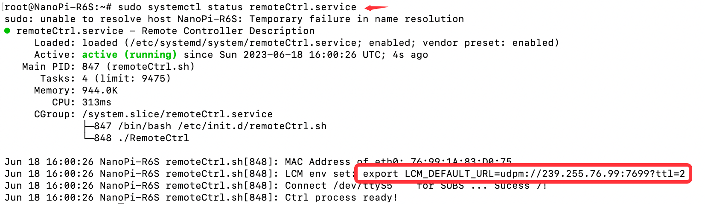

# 如何使用
## 一、实物机器人上电测试流程
### 1.1 悬吊机器人
使用移位吊装器将机器人吊起离地，膝关节打直状态下离地15cm
### 1.2 给机器人上电
#### 机器人内部供电
按照说明书操作指示流程启用机器人内部电源供电。
#### 外部直流电源供电
确认外接直流电源电压为36～42v范围，电流设置为10A，然后建外接电源连接到机器人外接供电接口，然后打开直流电源。
### 1.3 连接机器人网络
机器人内部网路配置为：
```
地址：192.168.55.x
掩码：255.255.255.0
网关：192.168.55.1
```
调试主机应当与机器人配置相同网段的网络，然后将调试网线连接到机器人的调试网络端口。
### 1.4 机器人悬空测试
1. ssh远程到机器人端，例如：
```
ssh root@192.168.55.20
```
2. 跳转到指定目录并运行平台节点程序
```
cd /home/debug/
./BodyLower
```

3. 查看机器人LCM广播域udpm
- 查看遥控器服务启动状态
```text
sudo systemctl status remoteCtrl.service
```
确认状态是否正常启动


- 复制上面的内容并配置到需要使用lcm通信或lcm-spy图形化显示的主机环境中
```
export LCM_DEFAULT_URL=udpm://239.255.76.67:7667?ttl=255
```
- 根据上面的udpm修改sim2real和sim2sim文件中main函数中的udpm链接


- 启动lcm-spy可视化lcm消息观测
```
export CLASSPATH=lcmCtrl.jar
lcm-spy
```

- 确认可以订阅到以下消息：
```
rc_state
body_state
lower_joint_state
```
- 启动user->sim2sim.py文件，按键D可以让机器人在仿真环境中正常摆动，同时对外发布关节目标信息：
```
lower_joint_target
```
可以看到实物机器人与仿真环境中的机器人同步运动
### 1.5 Sim2real测试
1. 初始化：运行sim2real.py，机器人会进入预定初始化状态。
2. 策略运行：按下遥控器CH6按键，机器人执行悬空摆腿策略。
3. 急停：同时将CH7和CH8向上按压到底，机器人会紧急停止。

## 移植自己的策略使用流程
1. 拷贝droid文件夹，建立自己的代码文件夹：user；
2. 将训练好的策略文件导出并放到user->policies文件夹内；
3. 根据自己的观测空间输入重写base->SimBase.py 基类文件，并根据自己的训练策略修改sim2sim.py和sim2real.py文件；
4. 在sim2sim.py和sim2real.py文件中指定自己的策略文件路径；
5. 在Config文件的第22行修改确认机器人模型文件路径，其他参数根据自己的需要修改调整；
6. Config.py -> control -> decimation参数用于同步设置策略文件的推理时间，单位是ms